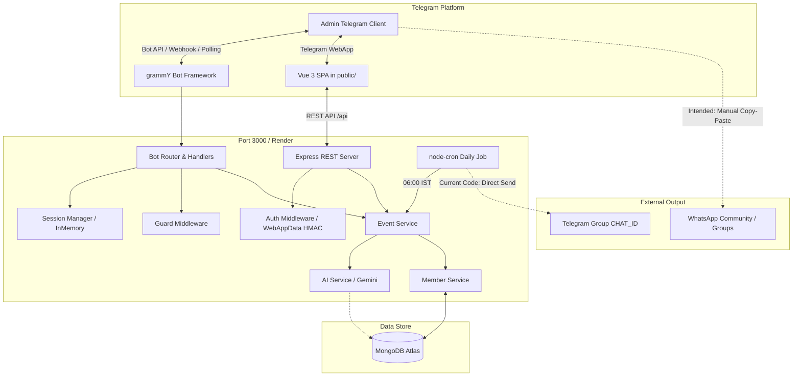

# Church CMS Telegram Bot — Technical Handover & System Audit Report

**Date of Audit:** October 5, 2026  
**Auditor Roles:** Senior Software Architect, Telegram Bot Specialist, Fullstack Node.js Engineer & Application Security Auditor  
**Target Audience:** Engineering Team / AI Successor (ChatGPT)  
**Status:** READ-ONLY Codebase Audit Completed  

---

## 1. Executive Summary & Project Overview

The **Church CMS Telegram Bot** (Salem Primitive Baptist Church / SPBC) is a centralized management system built with **Node.js (ES Modules)**, **grammY** (Telegram Bot framework), **Express.js**, and **MongoDB (Mongoose)**. The platform is designed to manage church member records, families, birthdays, wedding anniversaries, memorials, Scripture verses, and template generation.

### Primary Purpose & Operational Model
The system was conceived as a **private, admin-only administrative tool** designed to assist church administrators with preparing and reviewing daily personalized greetings (incorporating Tamil Bible verses and AI-assisted personalized messages).

### ⚠️ Critical Workflow Discrepancy (Intended vs. Current Implementation)
* **Intended Workflow:**  
  1. The bot runs a morning scheduled job.
  2. The bot drafts the daily greeting for birthdays/anniversaries with personalized Tamil Bible verses.
  3. The bot sends this draft to the **private Telegram Admin chat** for review.
  4. The Telegram UI provides an interactive **"Copy to Clipboard"** button.
  5. The administrator manually pastes the approved greeting into **WhatsApp groups/chats**.  
  *At no point should the system automatically broadcast to WhatsApp or blindly blast Telegram channels without human approval.*
* **Current Implementation in Codebase:**  
  1. In `src/scheduler/dailyJob.js`, the scheduler fetches celebrants at `06:00 IST` and immediately sends a direct message to `process.env.CHAT_ID` via `bot.api.sendMessage(chatId, text)`.
  2. If `CHAT_ID` is pointed at a group channel, it conducts an **automatic broadcast** without an admin-approval step.
  3. No interactive Telegram message copy button or admin verification workflow currently mediates the morning dispatch.

---

## 2. Architecture & Technology Stack

| Layer | Technology | Details / Version |
| :--- | :--- | :--- |
| **Runtime** | Node.js | v20+ (ES Modules: `"type": "module"`) |
| **Telegram Bot** | `grammY` (`^1.35.0`) | High-performance Telegram Bot framework |
| **Backend API** | `Express` (`^4.21.2`) | Embedded REST API inside bot process (`src/api/index.js`) |
| **Database** | MongoDB (`mongoose ^8.12.0`) | Document storage with compound indices and schema hooks |
| **Job Scheduling** | `node-cron` (`^3.0.3`) | Cron runner configured for `Asia/Kolkata` (IST) |
| **Frontend Web** | Vue 3 + Tailwind CSS | Single Page Application served from `public/` (Telegram WebApp / Mini App) |
| **AI Integration** | `@google/genai` (`^0.1.2`) | Google Gemini SDK for personalized greeting prayers/wishes |
| **Excel / CSV** | `xlsx` (`^0.18.5`) | Member bulk export and import |
| **Hosting** | Render.com | Web Service on free/starter tier, paired with `cron-job.org` uptime ping |



---

## 3. Directory Layout & Key Modules

```
whatsapp-chatbot/
├── .env.example              # Template for required environment variables
├── package.json              # Project metadata, scripts, and dependencies
├── render.yaml               # Render infrastructure-as-code specification
├── index.js                  # Application entrypoint: DB connect, Bot start, Express listen, Cron init
├── public/                   # Frontend SPA for Telegram WebApp / Admin Dashboard
│   ├── index.html            # Single Page HTML container with Tailwind CDN & Vue 3 mount
│   └── app.js                # Vue 3 application logic, state, components, and API integration
├── src/
│   ├── api/                  # Express REST API routes & Mini-App backend
│   │   ├── index.js          # REST controllers (/api/members, /api/stats, /api/settings, etc.)
│   │   └── middleware.js     # WebAppData validation & admin authentication guards
│   ├── bot/                  # Telegram Bot subsystem (grammY)
│   │   ├── guard.js          # Admin authorization filter (CRITICAL SECURITY AREA)
│   │   ├── router.js         # Central message & callback query dispatcher
│   │   ├── session.js        # In-memory user state machine with TTL cleanup
│   │   ├── ui.js             # Reusable keyboard layouts, pagination & formatting helpers
│   │   └── handlers/         # Screen-specific interactive bot handlers
│   │       ├── home.js       # Main menu and navigation
│   │       ├── members.js    # Member search, addition, editing, pagination, family linkage
│   │       ├── templates.js  # Message template customization and placeholder previews
│   │       ├── calendar.js   # Monthly/daily event calendar
│   │       ├── upcoming.js   # 7-day, 14-day, 30-day celebrant forecast
│   │       ├── memorial.js   # Memorial day tracking and remembrance
│   │       ├── settings.js   # Runtime config, notification timings, toggle flags
│   │       ├── stats.js      # Demographic and community statistics
│   │       └── bible.js      # Scripture verse lookup and selection
│   ├── models/               # Mongoose Data Models
│   │   ├── Member.js         # Core member entity with spouse relations and pre-save validation
│   │   ├── Template.js       # Dynamic message templates with placeholder support
│   │   ├── Settings.js       # Key-value persistent operational settings
│   │   ├── Bible.js          # Canonical Bible database (English & Tamil verses)
│   │   ├── EventVerse.js     # Association mapping specific verses to dates/events
│   │   ├── Memorial.js       # Memorial anniversary definitions
│   │   ├── Meta.js           # Schema migrations and version tracking
│   │   └── aiCache.js        # Persistent caching for generated AI prayers/greetings
│   ├── scheduler/            # Background tasks and automation
│   │   └── dailyJob.js       # Morning greetings dispatcher & evening reminder cron jobs
│   └── services/             # Core business logic layer
│       ├── aiService.js      # Gemini API prompt pipeline & fallback generators
│       ├── eventService.js   # Celebrant matching (leap-year safe) & greeting template composition
│       ├── memberService.js  # CRUD operations, search normalization, Excel import/export
│       └── exportService.js  # Report generation and data transformations
├── tests/                    # Automated testing suite
│   ├── api.test.js           # Unit tests for API utility functions
│   └── eventService.test.js  # Unit tests for celebrant matching & date logic
└── tools/
    └── scan-encoding.cjs     # Utility script verifying UTF-8 character encoding integrity
```

---

## 4. Database Schema & Data Models (Mongoose)

### 1. `Member` (`src/models/Member.js`)
* **Fields:**
  * `name` (String, required, indexed)
  * `gender` (Enum: `['Male', 'Female']`, required)
  * `birthday` (String: `DD-MM-YYYY` or `DD-MM`)
  * `wedding` (String: `DD-MM-YYYY` or `DD-MM`)
  * `phone` (String, optional)
  * `familyName` (String, indexed)
  * `spouse` (`ObjectId` ref `Member`, optional)
  * `photoFileId` (String, Telegram file identifier)
  * `isActive` (Boolean, default: `true`, indexed)
  * `isDeleted` (Boolean, default: `false`, indexed)
* **Compound Indexes:**
  * `{ isDeleted: 1, isActive: 1, birthday: 1 }`
  * `{ isDeleted: 1, isActive: 1, wedding: 1 }`
  * `{ familyName: 1, name: 1 }`
* **Pre-Save Lifecycle Hooks:**
  * Enforces mutual spouse relationship consistency.
  * Validates opposite gender pairing when spouse is specified.
  * *Note:* Mongoose `findOneAndUpdate` / `findByIdAndUpdate` bypasses `pre('save')` hooks unless `runValidators: true` and document middleware are explicitly used.

### 2. `Template` (`src/models/Template.js`)
* Manages text formatting for greetings.
* Types: `birthday`, `wedding`, `memorial`, `reminder`.
* Supported variables: `{name}`, `{spouse}`, `{years}`, `{verse}`, `{reference}`, `{prayer}`.

### 3. `Settings` (`src/models/Settings.js`)
* Single-document configuration store:
  * `morningSchedule`: Cron string (default: `0 6 * * *` - 06:00 AM IST).
  * `eveningReminder`: Boolean and time configuration.
  * `aiWishesEnabled`: Boolean toggle for Gemini enrichment.
  * `autoSend`: Boolean toggle (indicates auto vs manual review).

### 4. `Bible` & `EventVerse` (`src/models/Bible.js`, `src/models/EventVerse.js`)
* Holds book names, chapters, verses, and bilingual text (Tamil & English KJV/BBE).
* `EventVerse` pairs specific dates (`MM-DD`) with curated verses so that members born on the same date receive appropriate Scripture.

### 5. `aiCache` (`src/models/aiCache.js`)
* Caches generated blessings per member per event year (`TTL: 30 days`) to reduce Gemini API calls and maintain deterministic greetings upon re-render.

---

## 5. Telegram Bot Subsystem (`src/bot/`)

### Session Management (`src/bot/session.js`)
* **Mechanism:** In-memory `Map` keyed by Telegram `userId`.
* **TTL:** Automatic expiration after 10 minutes of inactivity.
* **State Payload:**
  ```javascript
  {
    step: 'AWAITING_MEMBER_NAME',
    data: { ...tempFields },
    lastActive: Date.now()
  }
  ```
* **Limitation:** In-memory state is wiped whenever Render cycles or restarts the container. Interactive multi-step wizards will fail if a user delays input during server restarts.

### Guard Middleware (`src/bot/guard.js`)
* Inspects incoming `ctx.from.id` against authorized admins.
* **⚠️ Critical Security Vulnerability:**
  ```javascript
  // Line 2 in src/bot/guard.js:
  if (!process.env.ADMIN_ID) return true;
  ```
  If `ADMIN_ID` is missing from the environment variables, the system **fails open**, granting complete administrative control to any user who messages the bot.

### UI Engine (`src/bot/ui.js`)
* Implements inline keyboard builders with standardized back buttons, pagination controls (`PAGE_SIZE = 8`), and confirmation dialogues.
* Provides date parsing and format conversion between `DD-MM-YYYY` and Tamil date representations.

### Router & Handlers (`src/bot/router.js` & `src/bot/handlers/*`)
* Dispatches incoming callbacks using prefix matching:
  * `m:*` -> Member handler
  * `t:*` -> Template handler
  * `c:*` -> Calendar handler
  * `u:*` -> Upcoming events
  * `b:*` -> Bible lookup
  * `s:*` -> Settings configuration

---

## 6. REST API & Web Dashboard (`src/api/` & `public/`)

### Express Application Server
* Embedded directly within the bot entrypoint (`index.js`).
* Listens on `process.env.PORT || 3000`.
* Serves the frontend single page app from `public/`.

### Endpoints
* `GET /ping` — Health check endpoint used by `cron-job.org` to keep the Render free-tier container alive.
* `GET /api/members` — List members with pagination, filtering, and search.
* `POST /api/members` — Add new member with photo and spouse linking.
* `PUT /api/members/:id` — Update member attributes.
* `DELETE /api/members/:id` — Soft-delete (`isDeleted: true`).
* `GET /api/stats` — Aggregate metrics: total count, male/female distribution, monthly celebrants.
* `GET /api/export` — Download full membership database as an Excel (`.xlsx`) spreadsheet.
* `POST /api/import` — Bulk import members via `.xlsx` or `.csv`.
* `GET /api/settings` & `PUT /api/settings` — Query and update application operational parameters.

### Authentication & Authorization (`src/api/middleware.js`)
* Validates Telegram WebApp initialization data (`window.Telegram.WebApp.initData`) via HMAC-SHA256 signature verification against the bot token.
* Bypasses verification if `process.env.ADMIN_SECRET` matches the provided Bearer token (intended for development/headless testing).

### Frontend Single Page Application (`public/index.html` & `public/app.js`)
* Built with **Vue 3 (Composition API / CDN)** and **Tailwind CSS**.
* Designed to adapt responsively whether viewed on desktop browsers or embedded inside Telegram's WebApp iframe.
* Features: Member directory table, search-as-you-type, multi-step creation modal, Excel import/export trigger, and diagnostics console.

---

## 7. Scheduler & Automation (`src/scheduler/dailyJob.js`)

### Daily Workflow Breakdown
1. **Cron Expression:** Configured by default to `0 6 * * *` (06:00 AM IST).
2. **Execution Steps:**
   * Query database for active members where `birthday` matches today's date (`DD-MM`).
   * Query database for couples where `wedding` matches today's date (`DD-MM`).
   * For each celebrant:
     * Retrieve matching Tamil Bible verse via `EventVerse` or fallback to random blessing verse.
     * If `aiWishesEnabled` is `true`, query Gemini API (`src/services/aiService.js`) to generate a 2-sentence prayer in Tamil.
     * Interpolate values into the configured `Template`.
3. **Dispatch:**
   * *Current Behavior:* Directly calls `bot.api.sendMessage(process.env.CHAT_ID, formattedText)`.
   * *Required Refactor:* Must send the rendered card with a "Copy Message" button to `process.env.ADMIN_ID` instead of posting directly to `CHAT_ID`.

---

## 8. External Integrations & Services

### 1. Google Gemini AI (`@google/genai`)
* Uses model `gemini-2.0-flash` (or configured fallback).
* Formatted prompt requests a traditional, reverent Tamil Christian birthday/anniversary prayer blessing.
* Response cached in `aiCache` collection to prevent redundant quota usage and ensure prompt determinism.
* Safe fallback: If Gemini API is rate-limited or fails, it falls back to hardcoded canonical Tamil blessings (`src/services/aiService.js`).

### 2. Tamil Bible Engine
* Canonical Tamil Bible stored in `Bible` collection (`old_testament` and `new_testament`).
* Provides scripture references for greeting headers and footers.

### 3. Telegram Bot API
* Webhook / Polling duality: Supports long polling in development and webhook mode for production deployments.
* File handling: Member profile photos are uploaded to Telegram servers; the system stores `file_id` strings to minimize local disk requirements.

---

## 9. Security & Vulnerability Audit

| Severity | Issue | Location | Remediation |
| :--- | :--- | :--- | :--- |
| **CRITICAL** | **Fail-Open Admin Guard** | `src/bot/guard.js:2` | Remove `if (!process.env.ADMIN_ID) return true;`. Always deny access if `ADMIN_ID` is unset. |
| **HIGH** | **Unprotected Telegram Direct Broadcast** | `src/scheduler/dailyJob.js` | Direct broadcast bypasses admin verification. Route daily output strictly to `ADMIN_ID` with an interactive copy button. |
| **MEDIUM** | **Bypass in WebApp HMAC Auth** | `src/api/middleware.js` | Ensure `ADMIN_SECRET` has minimum 32-character entropy and cannot be set to trivial default strings. |
| **MEDIUM** | **In-Memory Session Volatility** | `src/bot/session.js` | Memory wiped on restart. If multi-step forms are expanded, migrate state to MongoDB or Redis. |
| **LOW** | **Photo File ID Invalidation** | `src/models/Member.js` | Telegram `file_id` references may expire or change if the bot token is rotated. |

---

## 10. Data Integrity & Validation

### Date Handling
* Dates stored in `DD-MM-YYYY` or `DD-MM` format.
* **Leap Year Case:** Handled in `src/services/eventService.js` (Feb 29 celebrants are evaluated on Feb 28 on non-leap years).
* Strict regex validation (`/^(0[1-9]|[12][0-9]|3[01])-(0[1-9]|1[0-2])(-\d{4})?$/`) prevents invalid Gregorian dates.

### Marital Relationships
* `Member` schema enforces mutual reference: If Member A has spouse Member B, Member B must have spouse Member A.
* Gender validation ensures that wedding anniversaries feature complementary spouse pairings.

---

## 11. Testing & Verification Status

### Unit & Integration Tests
* Runner: Node.js native test runner (`node:test`, `node:assert/strict`).
* Existing tests:
  * `tests/eventService.test.js` — Validates leap-year celebrant matching, anniversary milestone math, and template string replacement.
  * `tests/api.test.js` — Validates query string parsers, sanitization routines, and pagination limits.
* **Current Result:** 5 passing tests (`npm test` passes in ~650ms).
* **Testing Deficits:**
  * No end-to-end tests for `src/bot/router.js` or callback queries.
  * No automated tests for the scheduler cron trigger (`src/scheduler/dailyJob.js`).
  * No automated integration tests for `src/api/index.js` endpoints with supertest.

---

## 12. Deployment & Hosting (Render & cron-job.org)

* **Platform:** Render Web Service.
* **Build Command:** `npm install`
* **Start Command:** `node index.js`
* **Spin-Down Prevention:**
  * Render free-tier instances sleep after 15 minutes of inactivity.
  * A scheduled job on `cron-job.org` issues a `GET /ping` request every 5 to 10 minutes to maintain active status.
  * *Notice:* Recent logs indicated `cron-job.org` HTTP error alerts. The `/ping` route must return an immediate `200 OK` without database query dependencies to guarantee zero-latency response.

---

## 13. Environment Variables Reference

| Variable | Required | Description | Example / Format |
| :--- | :--- | :--- | :--- |
| `BOT_TOKEN` | Yes | Telegram Bot API Token | `<BOT_TOKEN>` |
| `MONGODB_URI` | Yes | MongoDB Atlas Connection URI | `<MONGO_URI>` |
| `ADMIN_ID` | Yes | Telegram numeric User ID of administrator | `<ADMIN_ID>` |
| `CHAT_ID` | Optional | Telegram Channel/Group ID (if group alerts are used) | `<CHAT_ID>` |
| `GEMINI_API_KEY`| Optional | Google Gemini API Key for prayer generation | `AIzaSy...` |
| `ADMIN_SECRET` | Optional | Fallback secret for API / testing authentication | `32+ char random string` |
| `PORT` | Optional | HTTP Server listening port (default: 3000) | `3000` |
| `NODE_ENV` | Optional | Environment flag (`production` / `development`) | `production` |

---

## 14. Detailed Gap Analysis: Intended vs. Codebase

```
+-------------------------------------------------------------------------------+
|                             OPERATIONAL MODEL GAP                             |
+-------------------------------------------------------------------------------+
| INTENDED SPECIFICATION                        | CURRENT CODEBASE REALITY      |
+-----------------------------------------------+-------------------------------+
| 1. Private Telegram Admin Tool only.          | 1. Has group broadcast logic  |
|                                               |    sending to CHAT_ID.        |
| 2. Morning job sends card to ADMIN_ID.        | 2. Morning job broadcasts     |
|                                               |    directly to CHAT_ID.       |
| 3. Message contains "Copy to WhatsApp"        | 3. No clipboard helper button |
|    inline keyboard button.                    |    in Telegram message.       |
| 4. Admin performs manual paste to WhatsApp.   | 4. Assumes auto-dispatch.     |
| 5. Zero automated external broadcasts.        | 5. "Ping Group" diagnostic    |
|                                               |    exists in admin menu.      |
+-------------------------------------------------------------------------------+
```

---

## 15. The 5 Most Critical Remaining Tasks

1. **Fix Critical Fail-Open Vulnerability in `src/bot/guard.js`:**
   Ensure `isAdmin()` strictly returns `false` if `process.env.ADMIN_ID` is empty or invalid.
2. **Refactor Morning Cron to Private Admin Review:**
   Modify `src/scheduler/dailyJob.js` to dispatch exclusively to `process.env.ADMIN_ID` with an interactive **"📋 Copy Greeting"** button formatted for clean WhatsApp pasting.
3. **Ensure Zero-Downtime `/ping` Endpoint:**
   Verify `src/api/index.js` serves `GET /ping` instantly (returning `{ status: "ok", timestamp: ... }`) without waiting on Mongoose connections, preventing `cron-job.org` timeout failures.
4. **Implement Interactive Admin Approval & Copy Queue:**
   Add a dedicated `/review` screen or morning prompt where the admin can cycle through today's celebrants, regenerate AI wishes on demand, edit text, and copy with one click.
5. **Add Comprehensive API and Bot Integration Tests:**
   Introduce integration testing covering Express endpoints, WebApp HMAC authorization, and template rendering routines.

---

## 16. Technical Handover Instructions for ChatGPT / Successor

When continuing development on this repository:
1. **Preserve Database Schemas:** Do not alter the Mongoose compound indexes or date string formats (`DD-MM-YYYY`) to avoid breaking existing records in MongoDB Atlas.
2. **Adhere to the Single-File Entrypoint Architecture:** `index.js` orchestrates Express, grammY, and Mongoose simultaneously; keep them co-located in the same runtime process to accommodate Render free-tier deployment constraints.
3. **Strict Adherence to Admin-Only Workflow:** Never add automated WhatsApp API integrations or Twilio/Meta webhooks unless explicitly directed by the project lead. The application is strictly an admin curation assistant with manual copy-to-clipboard handover to WhatsApp.
4. **Encoding Integrity:** Ensure all Tamil Unicode characters in templates, prayers, and Bible verses are preserved as UTF-8 without escaping or double-encoding. Always run `npm run test:encoding` after modifying text assets.
