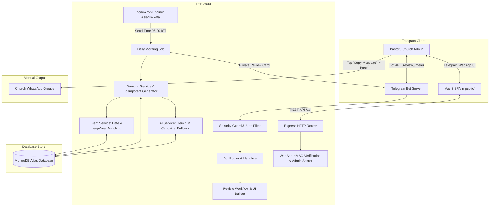

# Architecture Overview — SPBC Church CMS Telegram Bot

## 1. System Context & Top-Level Diagram

The application operates as a single-process service hosted on Render (or Railway/container platforms) combining an embedded **Express REST server**, a **grammY/Telegram Bot webhook/polling engine**, a **node-cron background scheduler**, and an integrated **Vue 3 Single Page Application (Telegram Mini App)**.

## 2. Component Breakdown

### 2.1 Backend Core (`src/app.js`, `src/api/index.js`, `src/api/middleware.js`)
- **Express.js:** Manages API routes for members, templates, settings, and greetings review.
- **Security Middleware:** 
  - Helmet for HTTP security headers.
  - Rate limiting (300 requests / 5 minutes) with webhook bypass.
  - HMAC-SHA256 signature verification for Telegram WebApp `initData`.
  - Fail-closed administrator authorization check on all sensitive endpoints.
- **Diagnostics (`/api/diagnostics`):** Non-blocking liveness check reporting uptime, database latency, process memory, and Node version.

### 2.2 Telegram Bot Subsystem (`src/bot/`)
- **Guard (`src/bot/guard.js`):** Fail-closed authorization engine validating `process.env.ADMIN_ID`.
- **Router (`src/bot/router.js`):** Dispatches callback queries (`review:*`, `members:*`, `templates:*`, `calendar:*`, `settings:*`) and conversational state inputs with error boundaries.
- **Review Handler (`src/bot/handlers/review.js`):** Interactive card deck allowing admins to preview celebrant messages, copy text directly, regenerate AI prayers, switch tones/styles, edit text inline, or skip greetings.
- **UI Engine (`src/bot/ui.js`):** Standardizes inline keyboard layouts and in-place message rendering.

### 2.3 Scheduler & Greeting Subsystem (`src/scheduler/dailyJob.js`, `src/services/greetingService.js`)
- **Daily Morning Job:** Runs daily at configured IST time (default `06:00`). Detects today's birthdays, anniversaries, and memorials.
- **Idempotency Guarantee:** Persists drafted greetings in `GreetingLog` with compound unique keys `{ dateKey, year, memberId, type }`. Repeated job triggers or restarts do not produce duplicates.
- **Zero Group Broadcasts:** All scheduled output is strictly dispatched privately to the authorized `ADMIN_ID`.

### 2.4 AI & Scripture Engine (`src/services/aiService.js`)
- **Scripture Source:** Uses stored canonical Tamil Bible verses (TAOVBSI) and curated mappings from `EventVerse`.
- **Gemini Integration:** Enhances blessings with contextual prayers without fabricating or hallucinating Scripture text.
- **Resilience:** If Gemini API is rate-limited or offline, gracefully falls back to deterministic, reverent canonical Tamil pastoral blessings.
- **Caching:** Generated blessings are cached in MongoDB (`AICache`) with 30-day TTL.

### 2.5 Member Lifecycle Management Subsystem (`src/services/memberService.js`)
- **Status State Machine:** Governs transitions between `active`, `inactive`, `transferred`, `deceased`, and `archived`.
- **Pre-Save Invariant Hooks:** Automatically maintains synchronization between `status` and boolean query flags `isActive` and `isDeleted`.
- **Duplicate Detection Engine:** Computes multi-dimensional similarity across names, phone numbers, and family+DOB combinations.
- **Audit Logging Engine (`src/models/AuditLog.js`):** Tracks state modifications, archiving, and restorations with user attribution and diffs.

### 2.6 Unified Church Calendar Subsystem (`src/services/churchCalendarService.js`, `src/models/ChurchEvent.js`)
- **Event Management:** Schedules Sunday worship, prayer meetings, fellowship, and revival conferences.
- **iCalendar Engine:** Generates standard RFC 5545 `.ics` streams for native calendar sync across iOS, Android, and Desktop.
- **Bot Scheduling Wizards:** Interactive `/events` list and `/addevent` conversational input wizard.

### 2.7 Administrative Task Management Subsystem (`src/services/taskService.js`, `src/models/Task.js`)
- **Task Categorization:** Supports pastoral care, event prep, facility maintenance, and member follow-ups.
- **Priority & Due Date Tracking:** Overdue computation with immediate visual and bot notifications.
- **Telegram Interaction:** Fast one-tap status toggling (`todo` <-> `completed`) via inline keyboards.

### 2.8 Reporting & Data Quality Audit Subsystem (`src/services/reportService.js`)
- **Church Statistics:** Aggregates demographics, gender distribution, married status, and task velocity.
- **Data Quality Audit:** Real-time health score calculation (0–100%) and inconsistency detection (missing names, non-ISO dates, orphaned marital pairs).
- **Security Sanitization:** Strict prefix escaping (`'`) against spreadsheet formula injection in exported files.
