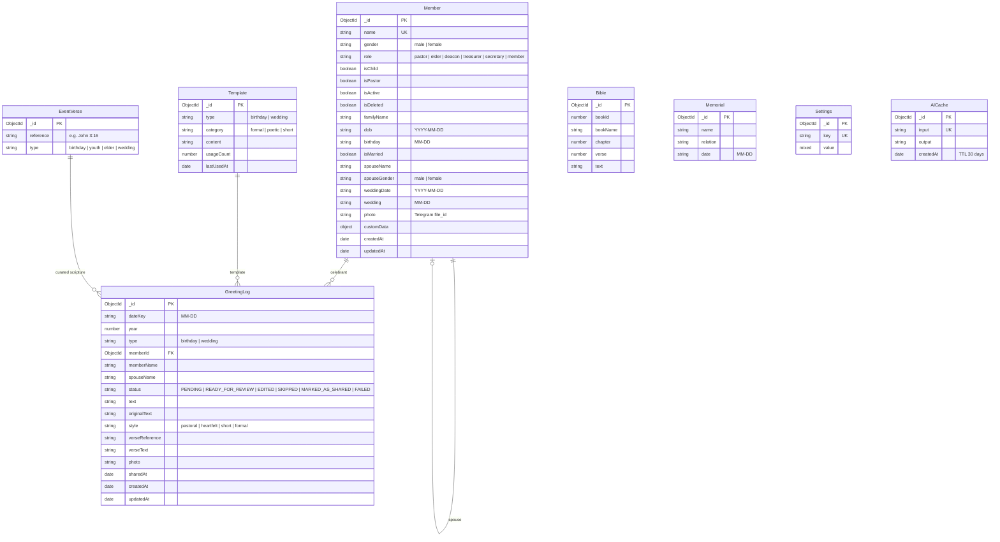

# Database Schema & Data Models — SPBC Church CMS

The application uses **MongoDB** managed via **Mongoose**. All collections are designed for query performance, indexing efficiency, and schema integrity.

---

## 1. Entity-Relationship Overview

---

## 2. Collections & Field Details

### 2.1 `Member` (`src/models/Member.js`)
- **Lifecycle & Contact Additions:**
  - `status`: enum `["active", "inactive", "transferred", "deceased", "archived"]` (default `"active"`)
  - `phone`: Contact phone number with duplicate collision checking.
  - `address`: Residential address for pastoral visits.
  - `ministry`: Active church department / ministry (e.g. Sunday School, Choir, Ushering).
  - `membershipDate`: Date joined or baptized (`YYYY-MM-DD`).
  - `adminNotes`: Confidential pastoral notes.
  - `spouseId`: Foreign key to spouse `Member` document.
  - `parentId`: Foreign key to parent `Member` document.
- **Key Indexes:**
  - `{ isDeleted: 1, isActive: 1, birthday: 1 }` (Zero-scan lookup for morning birthdays)
  - `{ isDeleted: 1, isActive: 1, wedding: 1 }` (Zero-scan lookup for wedding anniversaries)
  - `{ status: 1 }` (Status filtering)
  - `{ familyName: 1, name: 1 }` (Family roster navigation)
  - `{ phone: 1 }` (Fast duplicate lookups)
- **Validation Hooks:**
  - `pre("save")` hook synchronizes `status` with boolean flags `isActive` and `isDeleted`.
  - Enforces `spouseName` if `isMarried: true`.
  - Enforces opposite gender marriage constraint.

### 2.2 `ChurchEvent` (`src/models/ChurchEvent.js`)
- **Fields:**
  - `title`: Event name.
  - `category`: enum `["worship_service", "prayer_meeting", "fellowship", "special_service", "meeting", "other"]`
  - `description`: Event summary and sermon/choir details.
  - `startDate`, `endDate`: `YYYY-MM-DD`
  - `startTime`, `endTime`: `HH:MM`
  - `venue`: Physical location / sanctuary hall.
  - `recurrence`: enum `["none", "weekly", "monthly", "yearly"]`
  - `recurrenceEndDate`: Recurrence cutoff.
  - `status`: enum `["scheduled", "completed", "cancelled"]`
  - `createdBy`, `updatedBy`: Administrator attribution.
- **Indexes:**
  - `{ startDate: 1, startTime: 1 }`
  - `{ status: 1 }`

### 2.3 `Task` (`src/models/Task.js`)
- **Fields:**
  - `title`: Action item description.
  - `category`: enum `["pastoral_care", "event_prep", "admin", "facility", "follow_up", "general"]`
  - `priority`: enum `["low", "medium", "high", "urgent"]` (default `"medium"`)
  - `status`: enum `["todo", "in_progress", "waiting", "completed", "cancelled"]`
  - `dueDate`: `YYYY-MM-DD`
  - `assignee`: Assigned minister or deacon name.
  - `memberId`: Optional FK link to member for follow-ups.
  - `history`: Subdocuments tracking status changes with timestamp and user.
- **Indexes:**
  - `{ status: 1, dueDate: 1 }`
  - `{ priority: 1 }`

### 2.4 `AuditLog` (`src/models/AuditLog.js`)
- **Fields:**
  - `entity`: enum `["Member", "ChurchEvent", "Task", "Template", "Settings"]`
  - `entityId`: String ID of modified document.
  - `action`: enum `["CREATE", "UPDATE", "DELETE", "ARCHIVE", "RESTORE", "STATUS_CHANGE"]`
  - `performedBy`: User ID or display name.
  - `details`: Human-readable explanation.
  - `changes`: Object with `{ before, after }` state diffs.
  - `timestamp`: Date.
- **Indexes:**
  - `{ entity: 1, entityId: 1, timestamp: -1 }`

### 2.5 `GreetingLog` (`src/models/GreetingLog.js`)
- **Compound Unique Index:**
  - `{ dateKey: 1, year: 1, memberId: 1, type: 1 }`
- **Purpose:**
  - Provides strict idempotency across process restarts and repeated cron runs.
  - Retains history of pastoral edits and WhatsApp manual delivery tracking.

### 2.6 `Bible` & `EventVerse` (`src/models/Bible.js`, `src/models/EventVerse.js`)
- **Bible Model:** Holds the canonical Tamil Bible text (TAOVBSI - Tamil Aruna Old Version, Bible Society of India).
- **EventVerse Model:** Allows the administrator to associate preferred Bible references with specific event types.
