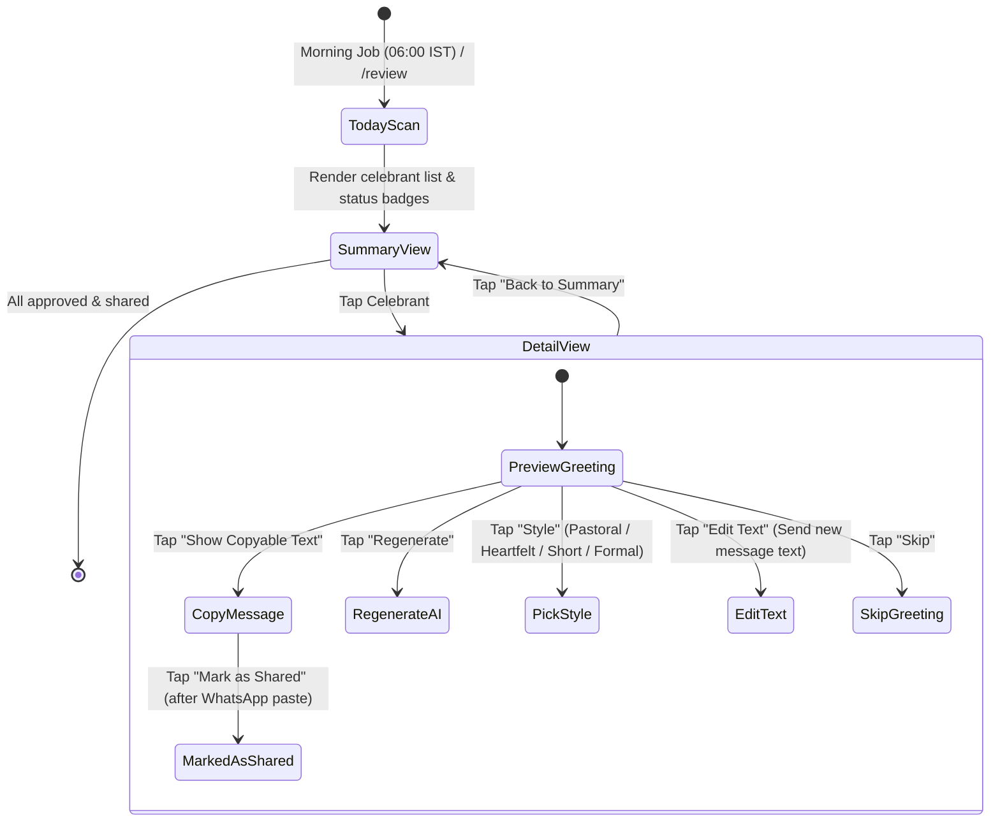

# Telegram Bot Command Inventory & Interaction Architecture

## 1. Administrative Command List

All commands require authorization via `src/bot/guard.js`. Non-admin requests are rejected with fail-closed security.

| Command | Arguments | Description |
|---|---|---|
| `/review` | None | Opens the interactive Greeting Review deck for today's celebrants. |
| `/start` or `/menu` | None | Displays the main administrative dashboard. |
| `/bible` | `<Reference>` | Queries the canonical Tamil Bible database (e.g. `/bible John 3:16` or `/bible யோவான் 3:16`). |
| `/addverse` | `<type> <ref>` | Associates a custom Scripture reference with an event (`birthday`, `wedding`, `youth`, `elder`). |
| `/listverses` | `[type]` | Lists curated custom Scripture verses in the database. |
| `/delverse` | `<id>` | Removes a custom Scripture reference by ID. |
| `/events` | None | Displays upcoming scheduled church services, meetings, and programs. |
| `/addevent` | None | Launches the conversational wizard to register a new church calendar event. |
| `/tasks` | `[overdue]` | Displays the administrative task queue and overdue items. |
| `/addtask` | None | Launches the conversational wizard to register a new task. |
| `/stats` | None | Shows church demographics, membership totals, and activity statistics. |
| `/dataquality` | None | Runs a real-time data quality audit on member records and displays health score. |
| `/addmemorial` | `<MM-DD> <Name> [, Note]` | Records a memorial remembrance anniversary. |
| `/listmemorials` | None | Lists all tracked memorial anniversaries. |
| `/delmemorial` | `<id>` | Removes a memorial record. |
| `/genwish` | `<Name>` | Tests and previews an on-demand AI pastoral wish for a specific member. |
| `/cancel` | None | Resets active conversation state and aborts any ongoing multi-step wizard. |
| `/help` | None | Displays the comprehensive administrative user manual. |

---

## 2. Interactive Review Workflow (`/review`)

The Greeting Review system is the primary daily interaction surface for church administrators:

---

## 3. Router Callback Namespaces (`src/bot/router.js`)

All inline button taps dispatch through standardized prefixed callback routes:

- `review:*` — Greeting review deck navigation, style switches, copy triggers, and status updates.
- `home:*` — Main menu navigation and help screens.
- `members:*` — Member roster pagination, profile views, field updates, role picker, family views, and trash restoration.
- `events:*` — Church event listing, pagination, details, creation, and cancellation.
- `tasks:*` — Administrative task dashboard, completion toggles, and priority filters.
- `templates:*` — Template browsing, creation wizards, edits, and deletion confirmations.
- `calendar:*` — Monthly event calendar view and month navigation (`calendar:show:<MM>`).
- `upcoming:*` — Forecast of upcoming celebrations for 7, 14, or 30 days (`upcoming:show:<days>`).
- `settings:*` — Automation toggles (birthdays, weddings) and cron broadcast schedule adjustments.
- `stats:*` — Real-time demographic, gender, family, and leadership statistics.
- `settings:*` — Morning dispatch time configuration, manual review scans, and admin ping verification.
